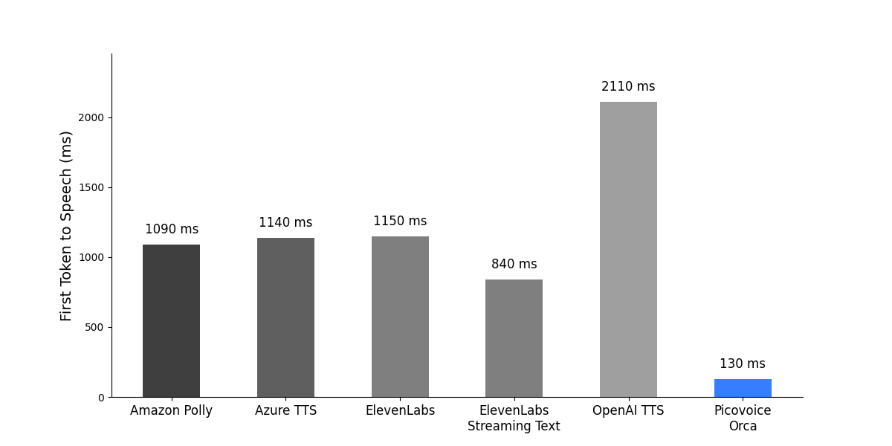
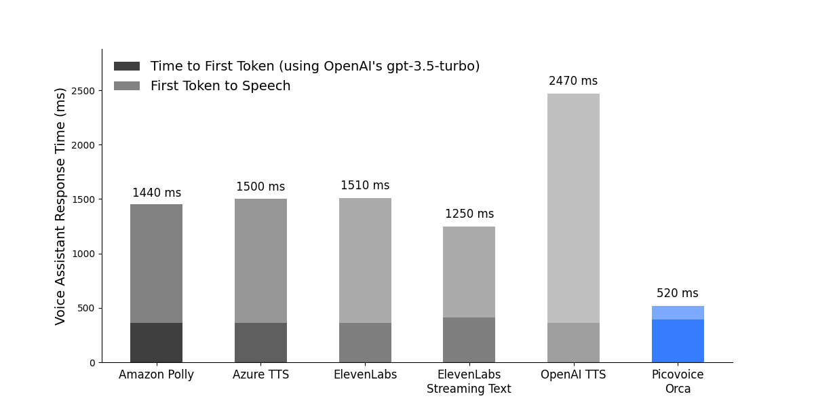

# Text-to-Speech Latency Benchmark

Made in Vancouver, Canada by [Picovoice](https://picovoice.ai)

This repo is a minimalist and extensible framework for benchmarking the response time of different text-to-speech
engines, when used in conjunction with large language models (LLMs) for voice assistants.

## Table of Contents

- [Overview](#overview)
- [Data](#data)
- [Engines](#engines)
- [Metrics](#metrics)
- [Usage](#usage)
- [Results](#results)

## Overview

This benchmark simulates user - voice-assistant interactions, by generating LLM responses to user questions
and synthesizing the response to speech as soon as possible.
We sample user queries from a public dataset and feed them to ChatGPT (`gpt-3.5-turbo`)
using [OpenAI Chat Completion API](https://platform.openai.com/docs/guides/text-generation/chat-completions-api).
ChatGPT generates responses token-by-token, which are passed to different text-to-speech (TTS) engines
to compare their response times.

## Data

The public [taskmaster2](https://huggingface.co/datasets/taskmaster2) dataset contains text data of goal oriented
conversations between a user and an assistant.
We randomly select user questions from these example conversations and use them as input to the LLM.
The topics of the user queries are diverse and include flight booking, food ordering, hotel booking, movies and music
recommendations, restaurant search, and sports.
The LLM is prompted to answer the questions like a helpful voice assistant to simulate a real-world user - AI
agent interactions. The responses of the LLM have various lengths, from a few words to a few sentences, to cover a wide
range of realistic responses.

## Engines

We compare the response time for the following Text-to-Speech engines:

- [Amazon Polly](https://aws.amazon.com/polly/)
- [Azure Text-to-Speech](https://azure.microsoft.com/en-us/services/cognitive-services/text-to-speech/)
- [ElevenLabs](https://elevenlabs.io/)
    - With streaming audio output only
    - With streaming input using [WebSocket API](https://elevenlabs.io/docs/api-reference/websockets)
- [OpenAI TTS](https://platform.openai.com/docs/guides/text-to-speech)
- [Picovoice Orca Streaming Text-to-Speech](https://picovoice.ai/platform/orca/)

All of the above engines support streaming audio output.
Elevenlabs also supports streaming input using a WebSocket API.
This is done by chunking the text at punctuation marks and sending pre-analyzed text chunks to the engine.
Orca Streaming Text-to-Speech supports input text streaming without relying on special language markers.
Orca can handle the raw LLM tokens as soon as they are produced.

## Metrics

Response times are typically measured with the `time-to-first-byte` metric, which is the time taken from the moment a
request was sent until the first byte is received.
In the context of assistants we care about the time it takes for the assistant to respond to the user.
For LLM-based voice assistants we define:

- **Voice Assistant Response Time (VART)**: Time taken from the moment the user's request is sent to the LLM, until the
  TTS engine produces the first byte of speech.

The `VART` metric is the sum of the following components:

- **Time to First Token (TTFT)**: Time taken from the moment the user's request is sent to the LLM, until the LLM
  produces the first byte of text.
- **First Token to Speech (FTTS)**: Time taken from the moment the LLM produces the first text token,
  until the TTS engine produces the first byte of speech.

The `TTFT` metric depends on the LLM and network latency in the case of LLM APIs.

The `FTTS` metric depends on the capabilities of the TTS engine, and whether it can handle streaming input text,
as well as the generation speed of the LLM.
In order to measure the `FTTS` metric, it is important to keep the LLM behavior constant across all experiments.

We believe the `FTTS` metric is the most appropriate way to measure the response time of a TTS engine in the context of
voice assistants. This is because it gets closest to the behavior of humans, who can start reading a response as
soon as the first token appears.

Note that for a complete voice assistant application we also need to consider the time it takes for the Speech-to-Text
system to send the request. Since we can use real-time Speech-to-Text engines like
Picovoice's [Cheetah Streaming Speech-to-Text](https://picovoice.ai/platform/cheetah/),
we can assume that the latency introduced by the Speech-to-Text is small compared to the total response time.
Head over to our GitHub demo
at [LLM Voice Assistant](https://github.com/Picovoice/orca/tree/main/demo/llm_voice_assistant),
showcasing a real voice-to-voice conversation with ChatGPT, using different TTS systems.

## Usage

This benchmark has been developed and tested on `Ubuntu 22.04`, using `Python 3.10`, and a consumer-grade AMD CPU
(`AMD Ryzen 9 5900X (12) @ 3.70GHz`).

- Install the requirements:

```console
pip3 install -r requirements.txt
```

In the following, we provide instructions for running the benchmark for each engine.
For each benchmark an OpenAI API key is required to generate responses from the LLM. Replace `${OPENAI_API_KEY}` with
it in the following instructions.

### Amazon Polly Instructions

Replace `${AWS_PROFILE}` with the name of the AWS profile you wish to use.

```console
python3 benchmark.py \
--openai-api-key ${OPENAI_API_KEY} \
--engine amazon_polly \
--aws-profile-name ${AWS_PROFILE}
```

### Azure Speech-to-Text Instructions

Replace `${AZURE_SPEECH_KEY}` and `${AZURE_SPEECH_LOCATION}` with the information from your Azure account.

```console
python3 benchmark.py \
--openai-api-key ${OPENAI_API_KEY} \
--engine azure_tts \
--azure-speech-key ${AZURE_SPEECH_KEY} \
--azure-speech-region ${AZURE_SPEECH_LOCATION}
```

### ElevenLabs Instructions

Replace `${ELEVENLABS_API_KEY}` with your ElevenLabs API key.

Without input streaming:

```console
python3 benchmark.py \
--openai-api-key ${OPENAI_API_KEY} \
--engine elevenlabs \
--elevenlabs-api-key ${ELEVENLABS_API_KEY}
```

With input streaming:

```console
python3 benchmark.py \
--openai-api-key ${OPENAI_API_KEY} \
--engine elevenlabs_websocket \
--elevenlabs-api-key ${ELEVENLABS_API_KEY}
```

### OpenAI TTS Instructions

Replace `${OPENAI_API_KEY}` with your OpenAI API key.

```console
python3 benchmark.py \
--openai-api-key ${OPENAI_API_KEY} \
--engine openai_tts
```

### Picovoice Orca Instructions

Replace `${PV_ACCESS_KEY}` with your Picovoice AccessKey.

```console
python3 benchmark.py \
--openai-api-key ${OPENAI_API_KEY} \
--engine picovoice_orca \
--picovoice-access-key ${PV_ACCESS_KEY}
```

## Results

The figures below show the response times of each engine by calculating the average over roughly 200 example
interactions.

### First Token to Speech



### Voice Assistant Response Time



### Table of Results

|           Engine           | First Token to Speech | Voice Assistant Response Time |
|:--------------------------:|:---------------------:|:-----------------------------:|
|        Amazon Polly        |        1090 ms        |            1440 ms            |
|    Azure Text-to-Speech    |        1140 ms        |            1500 ms            |
|         ElevenLabs         |        1150 ms        |            1510 ms            |
| ElevenLabs Streaming Input |        840 ms         |            1250 ms            |
|         OpenAI TTS         |        2110 ms        |            2470 ms            |
|       Picovoice Orca       |        130 ms         |            520 ms             |
